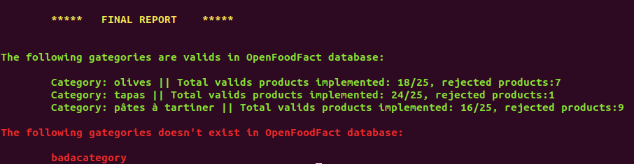

# Projet-8-Purbeurre

Search for a food product, and the application will find for you healther comparable products ! 

You can create an account, an save your favorite foods.

## Installation

The following steps are for bash:

**Clone this repository with:**
```sh
git clone https://github.com/MassDo/purbeurre.git
```
**Install dependencies with [pipenv](https://github.com/pypa/pipenv):**
```sh
cd purbeurre # default name of the project
pipenv install
```
**Create a postSQL database**
```sh
sudo -i -u postgres
createdb purbeurre 
```
If you have any difficulties see the postgresql [documentation](https://www.postgresql.org/).<br>
**Set environment variables**<br>
You need to set 2 environment variables:
* SECRET_KEY: django key.
* PASSWORD: your database password.<br>
**make the migrations**
Into the projet directory (purbeurre):
```sh
pipenv shell # activate the virtual env
./manage.py migrate 
```
Now the database schema are created but the database is empty we need to feed it with data from the OpenFoodFact project

## Database implementation
You can use the custom command data_feed to do it !
For example: 
```sh
./manage.py data_feed olives tapas badacategory 'pâtes à tartiner' --prod=25
```
You will have a report of the database implementation:


## Run the app

```sh
./manage.py runserver
```
The application is running on local http://127.0.0.1:8000/

## Deploying on heroku

Install heroku with this link:

https://devcenter.heroku.com/articles/heroku-cli#download-and-install

Deploy the app with this tutorial:

https://devcenter.heroku.com/articles/git
